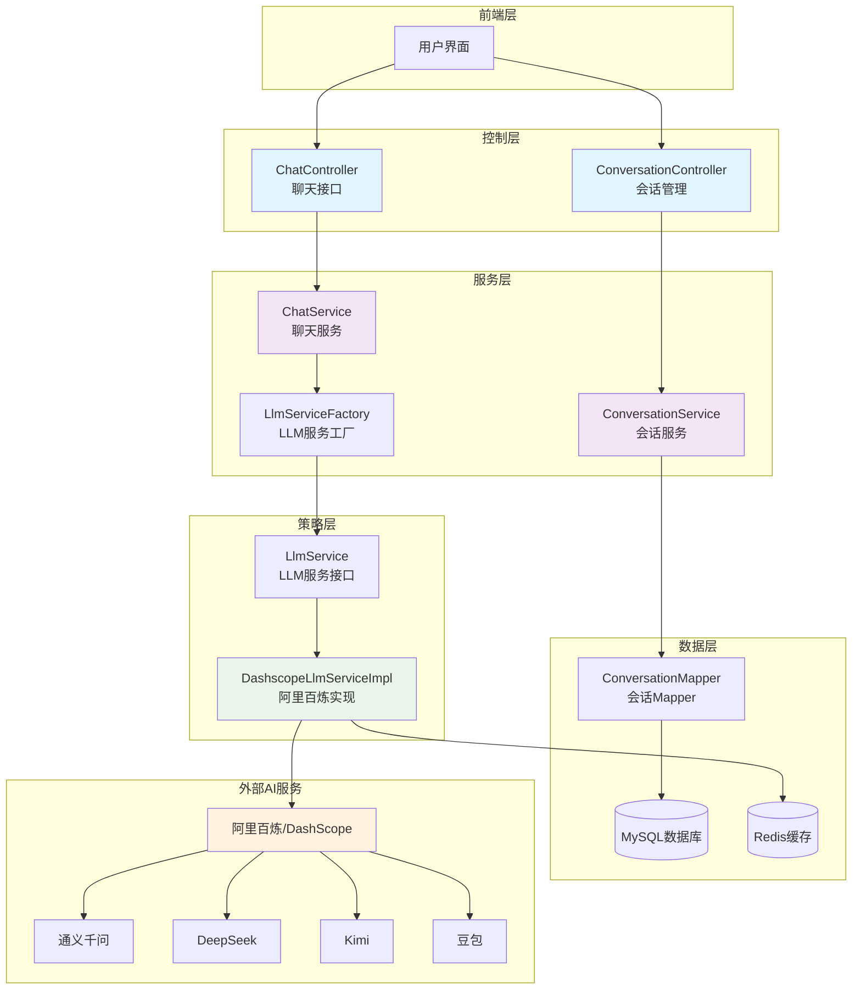

# 🤖 Spring AI Demo - 智能聊天机器人平台

<div align="center">


**基于 Spring AI Alibaba 构建的企业级智能对话平台**

[🚀 快速开始](#-快速开始) | [📖 API 文档](#-api-接口) | [🔧 配置说明](#-配置说明) | [🤝 贡献指南](#-贡献指南)

</div>

---

## 📋 项目简介

Spring AI Demo 是一个基于 Spring Boot 3.x 和阿里巴巴 Spring AI 框架构建的现代化智能聊天平台。该项目集成了多种主流 AI 大语言模型，提供流式对话、会话管理、记忆存储等企业级功能。

### ✨ 核心特性

- 🎯 **多模型支持**: 集成通义千问、DeepSeek、Kimi、豆包等主流 AI 模型
- 🔄 **流式对话**: 支持实时流式响应，提升用户体验
- 🧠 **智能记忆**: 基于 MySQL/Redis 的会话记忆管理
- 💭 **深度思考**: 支持 AI 模型的推理思考模式
- 🔍 **联网搜索**: 支持实时网络信息检索
- 📊 **会话管理**: 完整的对话历史管理和持久化
- 🏗️ **模块化设计**: 清晰的分层架构，易于扩展和维护

### 🎨 技术亮点

- **Spring AI Alibaba**: 阿里巴巴官方 AI 框架
- **响应式编程**: 基于 WebFlux 的流式响应
- **策略模式**: 可插拔的 LLM 服务提供商
- **自动建表**: 基于注解的数据库表自动创建
- **连接池管理**: Druid 数据库连接池监控

---

## 🏗️ 系统架构



---

## 🚀 快速开始

### 📋 环境要求

- ☕ **Java**: 17+
- 🗄️ **数据库**: MySQL 8.0+
- 🔴 **缓存**: Redis 6.0+
- 🛠️ **构建工具**: Maven 3.6+

### 🔧 安装步骤

1. **克隆项目**
   ```bash
   git clone https://github.com/your-username/jghAiDemo.git
   cd jghAiDemo
   ```

2. **配置数据库**
   ```sql
   CREATE DATABASE jghAiChat CHARACTER SET utf8mb4 COLLATE utf8mb4_unicode_ci;
   ```

3. **修改配置文件**
   
   编辑 `src/main/resources/application.yaml`:
   ```yaml
   spring:
     ai:
       dashscope:
         api-key: YOUR_DASHSCOPE_API_KEY  # 替换为你的API密钥
     datasource:
       url: jdbc:mysql://localhost:3306/jghAiChat?useUnicode=true&characterEncoding=UTF-8
       username: YOUR_DB_USERNAME
       password: YOUR_DB_PASSWORD
     data:
       redis:
         host: localhost
         port: 6379
   ```

4. **启动项目**
   ```bash
   mvn clean spring-boot:run
   ```

5. **访问应用**
   - 应用地址: `http://localhost:8888/api`
   - Druid 监控: `http://localhost:8888/api/druid`

---

## 🎯 支持的 AI 模型

| 模型 | 提供商 | 特性 | 状态 |
|------|--------|------|------|
| 🌟 **通义千问** | 阿里巴巴 | 思考模式融合，推理能力强 | ✅ 支持 |
| 🧠 **DeepSeek-R1** | DeepSeek | 强化学习，推理能力突出 | ✅ 支持 |
| 🚀 **DeepSeek-V3** | DeepSeek | MoE架构，671B参数 | ✅ 支持 |
| 🌙 **Kimi K2** | 月之暗面 | MoE模型，Agent能力优化 | ✅ 支持 |
| 🎨 **豆包** | 字节跳动 | 多模态思考，256k上下文 | ✅ 支持 |

### 🔮 模型切换示例

```json
{
  "conversationId": "conv-123",
  "message": "解释一下量子计算的原理",
  "modelName": "deepseek-r1",
  "enableThinking": true,
  "enableSearch": false
}
```

---

## 📖 API 接口

### 💬 聊天接口

#### **流式对话**
```http
POST /api/chat/stream
Content-Type: application/json

{
  "conversationId": "optional-conversation-id",
  "message": "你好，请介绍一下你自己",
  "modelName": "qwen",
  "enableThinking": false,
  "enableSearch": false
}
```

**响应 (Server-Sent Events):**
```
data: {"content":"你好！","isEnd":false,"recordType":"text"}
data: {"content":"我是一个AI助手","isEnd":false,"recordType":"text"}
data: {"content":"...","isEnd":true,"recordType":"text"}
```

### 🗂️ 会话管理

#### **获取会话列表**
```http
POST /api/conversation/page
x-auth-userId: 123
Content-Type: application/json

{
  "current": 1,
  "size": 10
}
```

#### **删除会话**
```http
DELETE /api/conversation/{id}
```

#### **更新会话**
```http
PUT /api/conversation/{id}
Content-Type: application/json

{
  "title": "新的会话标题"
}
```

---

## 🔧 配置说明

### 🗄️ 数据库配置

```yaml
spring:
  datasource:
    driver-class-name: com.mysql.cj.jdbc.Driver
    url: jdbc:mysql://localhost:3306/jghAiChat?useUnicode=true&characterEncoding=UTF-8
    username: root
    password: password
    druid:
      initial-size: 5
      min-idle: 5
      max-active: 20
      max-wait: 60000
```

### 🔴 Redis 配置

```yaml
spring:
  data:
    redis:
      host: localhost
      port: 6379
      database: 0
      lettuce:
        pool:
          max-active: 100
          max-idle: 100
          min-idle: 20
```

### 🤖 AI 模型配置

```yaml
spring:
  ai:
    dashscope:
      api-key: sk-your-api-key-here
```

---

## 📁 项目结构

```
src/main/java/com/jgh/springaidemo/
├── 📱 chatbot/                    # 聊天机器人模块
│   ├── 🎮 controller/             # 控制器层
│   │   ├── ChatController.java
│   │   └── ConversationController.java
│   ├── 🔧 service/                # 服务层
│   │   ├── ChatService.java
│   │   ├── ConversationService.java
│   │   └── impl/
│   ├── 🏗️ strategy/               # 策略模式实现
│   │   ├── LlmService.java
│   │   ├── LlmServiceFactory.java
│   │   └── impl/
│   │       └── DashscopeLlmServiceImpl.java
│   ├── 📊 entity/                 # 实体类
│   ├── 📝 dto/                    # 数据传输对象
│   ├── 🎯 enums/                  # 枚举类
│   └── 🗄️ dao/                    # 数据访问层
├── 🛠️ common/                     # 公共模块
│   ├── config/
│   ├── enums/
│   ├── handler/
│   └── utils/
└── 📋 SpringAiDemoApplication.java # 应用启动类
```

---

## 🛠️ 开发指南

### 🆕 添加新的 AI 模型提供商

1. **实现 LlmService 接口**
   ```java
   @Service
   public class NewAiServiceImpl implements LlmService {
       @Override
       public String getProviderType() {
           return "new-ai-provider";
       }
       
       @Override
       public Flux<AiChatResponse> chatStream(ChatRequest request, String sessionId) {
           // 实现具体逻辑
       }
   }
   ```

2. **注册到工厂类**
   ```java
   @Service
   public class LlmServiceFactory {
       // 添加新的服务提供商
   }
   ```

3. **添加模型枚举**
   ```java
   public enum ModelEnums {
       NEW_MODEL("new-model", "描述", "new-ai-provider", "model-code");
   }
   ```

### 🔍 调试技巧

- **SQL 日志**: 已启用 MyBatis 日志输出
- **Druid 监控**: `/druid/*` 路径访问数据库监控
- **Redis 连接**: 检查 Redis 连接配置

---

## 🔬 技术选型

| 技术栈 | 版本 | 说明 |
|--------|------|------|
| Spring Boot | 3.5.4 | 核心框架 |
| Spring AI Alibaba | 1.0.0.2 | AI 集成框架 |
| MyBatis Plus | 3.5.12 | ORM 框架 |
| Druid | 1.2.20 | 数据库连接池 |
| Redis | - | 缓存存储 |
| MySQL | 8.0+ | 关系数据库 |
| Lombok | 1.18.30 | 代码生成 |
| Hutool | 5.8.25 | 工具类库 |

---

## 🐛 故障排除

### 常见问题

1. **API Key 错误**
   ```
   错误: Invalid API key
   解决: 检查 application.yaml 中的 dashscope.api-key 配置
   ```

2. **数据库连接失败**
   ```
   错误: Could not create connection to database
   解决: 确认 MySQL 服务已启动，用户名密码正确
   ```

3. **Redis 连接异常**
   ```
   错误: Unable to connect to Redis
   解决: 检查 Redis 服务状态和配置
   ```

### 💡 性能优化建议

- 合理设置数据库连接池大小
- 使用 Redis 缓存频繁查询的数据
- 监控 AI 模型调用频率，避免超出限额

---

## 🤝 贡献指南

我们欢迎所有形式的贡献！

### 🔀 贡献流程

1. Fork 本项目
2. 创建特性分支 (`git checkout -b feature/amazing-feature`)
3. 提交更改 (`git commit -m 'Add some amazing feature'`)
4. 推送分支 (`git push origin feature/amazing-feature`)
5. 创建 Pull Request

### 📝 代码规范

- 遵循 Java 编码规范
- 添加必要的注释和文档
- 编写单元测试
- 确保代码质量检查通过

---

## 📄 开源协议

本项目基于 [MIT License](LICENSE) 开源协议。

---

## 👥 维护团队

- **项目负责人**: [@JiuGHim](https://github.com/JiuGHim)
- **技术支持**: 提交 Issue 或加入讨论群

---

## 🙏 致谢

- [Spring AI Alibaba](https://github.com/alibaba/spring-ai-alibaba) - 提供 AI 集成能力
- [阿里云百炼平台](https://bailian.console.aliyun.com/) - AI 模型服务
- [Spring Boot](https://spring.io/projects/spring-boot) - 基础框架

---

<div align="center">

**如果这个项目对你有帮助，请给个 ⭐ Star 支持一下！**

[🔝 回到顶部](#-spring-ai-demo---智能聊天机器人平台)

</div>